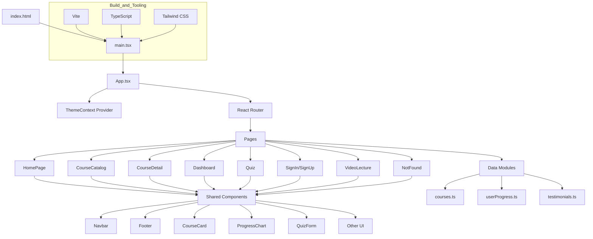

# E-Learning Platform

[](LICENSE)
[](https://www.typescriptlang.org/)

---

## 🗺️ Workflow Diagram



---

## 📚 Overview

**E-Learning Platform** is a robust and scalable web application providing interactive online learning experiences for students and instructors. Built entirely with TypeScript and modern frontend technologies, this project is a **client-side only** (frontend) application—no backend or server-side code is included.

---

## ✨ Features

- **User Authentication (Frontend Only):** UI flows for registration and login (no real backend).
- **Course Management:** Browse, organize, and view courses with modules, lessons, and resources (UI mockups).
- **Interactive Content:** Support for videos, PDFs, quizzes, and discussion forums (frontend components only).
- **Progress Tracking:** Visualize student progress and reports (client-side only).
- **Responsive Design:** Seamless user experience across desktop, tablet, and mobile.
- **Admin Dashboard:** UI for managing users, courses, and analytics (mocked).

---

## 🛠️ Tech Stack

- **TypeScript** (primary language)
- **React** (SPA, component-based architecture)
- **Vite** (build/bundle tool)
- **Tailwind CSS** (utility-first styling)
- **PostCSS** (CSS transformation)
- **React Router** (client-side routing)
- **No backend or database**—all data is from client-side mock modules

---

## 🏗️ Project Structure

```
├── public/
│   └── index.html
├── src/
│   ├── main.tsx          # Bootstrap app, ReactDOM.render
│   ├── App.tsx           # Top-level component, routing, context
│   ├── index.css         # Global styles (Tailwind base)
│   ├── components/       # Reusable UI components
│   │   ├── auth/
│   │   ├── courses/
│   │   ├── dashboard/
│   │   ├── home/
│   │   ├── layout/
│   │   └── ui/
│   ├── pages/            # Routed pages (Home, Catalog, Detail, Quiz, Dashboard, Auth, Video, 404)
│   ├── context/          # React Context providers (Theme, etc.)
│   ├── data/             # Mock data modules (courses, testimonials, userProgress)
│   └── types/            # TypeScript interfaces and types
├── package.json
├── tsconfig.json
├── vite.config.ts
├── postcss.config.js
├── tailwind.config.js
└── README.md
```

---

## 🚀 Getting Started

### Prerequisites

- [Node.js](https://nodejs.org/) (v14 or higher)
- [npm](https://www.npmjs.com/) or [yarn](https://yarnpkg.com/)

### Installation

1. **Clone the repository:**
   ```bash
   git clone https://github.com/sinha-19/E-Learning-Platform.git
   cd E-Learning-Platform
   ```

2. **Install dependencies:**
   ```bash
   npm install
   # or
   yarn install
   ```

3. **Run the application:**
   ```bash
   npm start
   # or
   yarn start
   ```

4. **Open in your browser:**
   - Visit [http://localhost:3000](http://localhost:3000) (or the port shown in your terminal).

---

## 🛤️ Application Flow

1. User visits the site (`index.html` → `main.tsx` → `App.tsx`).
2. The `ThemeContext` provider injects theme state (light/dark) into all components.
3. `App.tsx` sets up `React Router` for SPA navigation.
4. Pages (Home, Catalog, Detail, Dashboard, Quiz, Auth, Video, NotFound) are rendered based on route.
5. Pages and components import mock data modules from `/src/data`.
6. All UI is responsive and styled with Tailwind CSS, with global theme and state managed by context.
7. The build system (Vite, TypeScript, Tailwind) compiles and bundles everything for local dev or production.

---

## 🤝 Contributing

Contributions are welcome! Please open issues and submit pull requests for improvements or bug fixes.

1. Fork the repository.
2. Create a new branch for your feature or bugfix.
3. Commit your changes and push to your fork.
4. Open a pull request with a detailed description.

---

## 📄 License

This project is licensed under the [MIT License](LICENSE).

---

## 📬 Contact

For questions, suggestions, or support, please open an issue or contact the repository owner:

- **GitHub:** [sinha-19](https://github.com/sinha-19)

---

*Empowering education through technology.*
